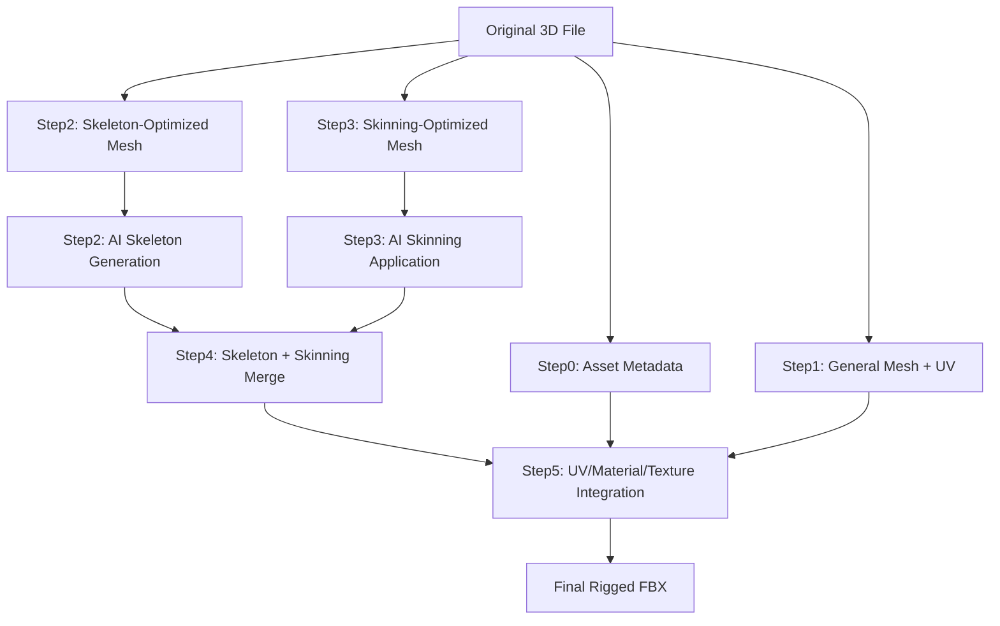

# UniRig WebUI (app.py) - 開発フロー・データフロー完全ガイド

**作成日**: 2025年6月16日  
**対象**: UniRigプロジェクト開発チーム  
**目的**: app.pyを起点とした開発時の正確なフローとアーキテクチャ理解  
**重要度**: **最高** (プロジェクトの中核ファイル)

---

## 📊 app.py 概要

### 🎯 核心的な役割
UniRig WebUIの**中央オーケストレーター**として機能し、以下を統合管理：

1. **Gradio WebUI**: ユーザーインターフェース提供
2. **パイプライン制御**: Step0-Step5の順次実行管理
3. **データフロー管理**: 決め打ちディレクトリ戦略による統一的データ管理
4. **エラーハンドリング**: 包括的なエラー検出・診断・回復システム
5. **統合オーケストレーション**: src/pipeline + step_modules の統合実行

### 📋 技術的特徴
```python
# 主要な技術統合
- Gradio WebUI (フロントエンド)
- FixedDirectoryManager (決め打ちディレクトリ管理)
- UnifiedPipelineOrchestrator (統一パイプライン制御)
- PipelineErrorAnalyzer (エラー解析システム)
- IntermediateDataCleaner (データクリーンアップ)
- step_modules integration (モジュール統合)
- src/pipeline integration (パイプライン統合)
```

---

## 🏗️ アーキテクチャ構造

### 🎯 レイヤー分離設計
```
🌐 Gradio WebUI Layer (ユーザーインターフェース)
        ↓
🎯 Application Orchestration Layer (app.py)
        ↓
🔧 Pipeline Management Layer (UnifiedPipelineOrchestrator)
        ↓
📁 Directory Management Layer (FixedDirectoryManager)
        ↓
⚙️ Step Execution Layer (step_modules + src/pipeline)
        ↓
🧠 Core AI Processing Layer (Model + System)
```

### 📁 決め打ちディレクトリ戦略 (核心設計)
```
/app/pipeline_work/{model_name}/
├── 00_asset_preservation/          # Step0: 元データ・メタデータ保存
├── 01_extracted_mesh/              # Step1: 汎用メッシュ抽出（UV保持）
│   └── {model_name}_mesh.npz       # Step5用UV・マテリアル情報
├── 02_skeleton/                    # Step2: スケルトン生成
│   ├── mesh_for_skeleton/          # Step2専用メッシュ（AI最適化）
│   │   └── raw_data.npz            # faces_count=4000
│   ├── {model_name}_skeleton.fbx   # スケルトンFBX
│   └── {model_name}_skeleton.npz   # スケルトンデータ
├── 03_skinning/                    # Step3: スキニング適用
│   ├── mesh_for_skinning/          # Step3専用メッシュ（スキニング最適化）
│   │   └── raw_data.npz            # faces_count=50000
│   ├── {model_name}_skinned.fbx    # スキニング済みFBX
│   └── {model_name}_skinning.npz   # スキニングデータ
├── 04_merge/                       # Step4: 骨・スキン統合
│   └── {model_name}_merged.fbx     # マージ済みFBX
└── 05_blender_integration/         # Step5: 最終成果物
    └── {model_name}_final.fbx      # ユーザー最終出力 ⭐
```

---

## 🔄 パイプライン処理フロー

### 🚀 一気通貫処理フロー (execute_complete_pipeline)

#### 1. **事前システム検証**
```python
# システム要件確認
error_analyzer = PipelineErrorAnalyzer(app_logger)
system_check = error_analyzer.validate_system_requirements()
if not system_check["valid"]:
    return False, f"システム検証失敗: {system_check['message']}"
```

#### 2. **ファイル保存・ディレクトリ構築**
```python
# 決め打ちディレクトリ戦略適用
fdm = FixedDirectoryManager(PIPELINE_BASE_DIR, model_name, app_logger)
fdm.create_all_directories()

# オリジナルファイル保存
target_path = fdm.model_dir / original_filename
shutil.copy(input_file_path, target_path)
```

#### 3. **Step0-Step5 順次実行**
```python
# 各ステップの順次実行・エラー診断
for step in ["step0", "step1", "step2", "step3", "step4", "step5"]:
    success, step_logs = execute_stepX(...)
    if not success:
        error_report = error_analyzer.diagnose_execution_error(
            Exception(step_logs), step
        )
        return False, f"Step失敗: {error_report['suggested_solution']}"
```

#### 4. **最終検証・完了率計算**
```python
# パイプライン完了状況確認
final_check = fdm.get_pipeline_completion_status()
completion_rate = sum(final_check.values()) / len(final_check) * 100

# 最終出力ファイル確認
final_fbx = fdm.get_step_dir('step5') / f'{model_name}_final.fbx'
if final_fbx.exists():
    file_size = final_fbx.stat().st_size / (1024 * 1024)  # MB
```

#### 5. **自動クリーンアップ (オプション)**
```python
# 自動中間データクリーンアップ
if auto_cleanup and completion_rate >= 100.0:
    cleaner = IntermediateDataCleaner(logger_instance=app_logger)
    cleanup_success, cleanup_message = cleaner.cleanup_specific_model(model_name)
```

---

## ⚙️ 各ステップの詳細フロー

### 🔧 Step0: アセット保存 (execute_step0)
```python
目的: オリジナルファイルの詳細情報保存（UV・マテリアル・テクスチャ）
実装: Step0AssetPreservation クラス使用
出力: メタデータJSON + テクスチャファイル群
重要性: Step5でのテクスチャ復元の基盤データ
```

### 🔧 Step1: メッシュ抽出 (execute_step1_wrapper)
```python
目的: 汎用メッシュ抽出（UV座標・マテリアル情報保持）
実装: step_modules.step1_extract.execute_step1
出力: {model_name}_mesh.npz (Step5用データ保持)
特徴: UV・マテリアル情報を最大限保持する汎用抽出
```

### 🔧 Step2: スケルトン生成 (execute_step2)
```python
目的: AI駆動スケルトン構造予測
重要: 必ずオリジナルファイルからメッシュ再抽出を実行
実装: step_modules.step2_skeleton.Step2Skeleton
処理順序:
  1. オリジナルファイル検索
  2. スケルトン生成専用メッシュ再抽出 (faces_target_count=4000)
  3. run.py + YAML設定によるAI推論実行
出力: {model_name}_skeleton.fbx + {model_name}_skeleton.npz
```

### 🔧 Step3: スキニング適用 (execute_step3)
```python
目的: メッシュとスケルトンの結合（スキニング）
重要: 必ずオリジナルファイルからメッシュ再抽出を実行
実装: step_modules.step3_skinning_unirig.Step3Skinning
処理順序:
  1. オリジナルファイル検索
  2. Step2出力ファイル検証 (predict_skeleton.npz)
  3. スキニング専用メッシュ再抽出 (faces_target_count=50000)
  4. run.py + YAML設定によるスキニング実行
出力: {model_name}_skinned.fbx + {model_name}_skinning.npz

修正履歴: 2025年6月16日
- src.system.skin直接呼び出し → run.py + YAML + Lightning使用に変更
- 原流generate_skin.sh完全互換性実現
```

### 🔧 Step4: 3つのデータソース統合マージ (execute_step4)
```python
目的: オリジナルメッシュ + AIスケルトン(Step2) + AIスキニング(Step3) 統合
実装: UnifiedMergeOrchestrator.merge_three_data_sources_unified
入力: user_upload_file + skinned_fbx(Step3出力) + skeleton_data(メモリ内)
出力: {model_name}_merged.fbx
核心技術: KDTree最近傍マッチングによる頂点数差異吸収システム
特徴: src.inference.merge.transfer()による高度な3Dデータ統合処理
重要: source=skinned_fbx(Step3出力), target=original_file(ユーザーアップロード)
```

### 🔧 Step5: 最終統合 (execute_step5)
```python
目的: UV・マテリアル・テクスチャ統合 (Blender使用)
実装: UnifiedBlenderOrchestrator.integrate_with_blender_unified
入力: merged_fbx + original_file
処理:
  1. GitHubパターンによるUV座標転送
  2. マテリアルノード再構築
  3. テクスチャ統合・FBXパッキング
出力: {model_name}_final.fbx (ユーザー最終成果物)
技術: Blender 4.2 API完全対応
```

---

## 🎯 データフロー図

### 📊 データ変換チェーン


### 🔄 メッシュ再抽出戦略 (重要な知見)
```python
# 各ステップでの異なるメッシュ抽出パラメータ
Step1: 汎用抽出          # UV・マテリアル保持重視
Step2: AI推論特化抽出    # faces_target_count=4000 (AI最適化)
Step3: スキニング特化抽出 # faces_target_count=50000 (スキニング最適化)

# この差異がクオリティ保証の根幹
```

---

## 🛠️ エラーハンドリング・診断システム

### 🔍 PipelineErrorAnalyzer 統合
```python
# 各ステップでのエラー診断・解決策提示
error_analyzer = PipelineErrorAnalyzer(app_logger)

# システム要件検証
system_check = error_analyzer.validate_system_requirements()

# 入力検証
validation_result = error_analyzer.validate_input_requirements(step, params)

# エラー診断・解決策提示
error_report = error_analyzer.diagnose_execution_error(exception, step)
```

### 📊 FixedDirectoryManager による状態管理
```python
# パイプライン完了状況の詳細追跡
completion_status = fdm.get_pipeline_completion_status()
# 例: {'step0': True, 'step1': True, 'step2': False, ...}

# 期待ファイルの存在確認
expected_files = fdm.get_expected_files("step3")
# 例: {'skinned_fbx': Path(...), 'skinning_npz': Path(...)}

# 入力検証（ステップ間の依存関係確認）
valid, message, available_files = fdm.validate_step_inputs("step4")
```

---

## 🧹 中間データ管理システム

### 📊 IntermediateDataCleaner 機能
```python
# 中間データ分析
analysis = cleaner.analyze_intermediate_data()
# 返り値: 総サイズ、ファイル数、モデル一覧、ステップ状況

# 特定モデルのクリーンアップ
success, message = cleaner.cleanup_specific_model(model_name, create_backup)

# 全中間データクリーンアップ
success, message = cleaner.cleanup_intermediate_data(create_backup)
```

### ⚙️ 自動クリーンアップ機能
```python
# パイプライン完了後の自動クリーンアップ
if auto_cleanup and completion_rate >= 100.0:
    cleaner = IntermediateDataCleaner(logger_instance=app_logger)
    cleanup_success, cleanup_message = cleaner.cleanup_specific_model(
        model_name, create_backup=False
    )
```

---

## 🌐 Gradio WebUI 構造

### 📋 UI コンポーネント構成
```python
# メイン機能
- 3Dファイルアップロード (.glb, .fbx, .obj, .vrm)
- 性別設定 (neutral, male, female)
- 自動クリーンアップオプション
- 一気通貫実行ボタン
- 最終FBXダウンロード

# デバッグ機能
- 個別ステップ実行 (Step0-Step5)
- パイプライン状態表示
- 実行ログ表示
- リセット・状態更新

# データ管理機能
- 中間データ分析
- 特定モデルデータ削除
- 全中間データ削除
- バックアップ作成オプション
```

### 🎯 イベントハンドラー戦略
```python
# ファイルアップロード → 自動モデル名抽出 → ディレクトリ作成
uploaded_file.change(handle_upload, [uploaded_file], [model_name_input, log_display])

# 一気通貫実行 → 詳細ログ表示
complete_pipeline_btn.click(handle_complete_pipeline, [uploaded_file, gender_input, auto_cleanup_checkbox], log_display)

# 個別ステップ実行 → リアルタイムログ
step2_btn.click(handle_step2, [model_name_input, gender_input], log_display)

# 状態更新 → 詳細状況表示
refresh_btn.click(get_status, [model_name_input], status_display)
```

---

## 🔧 開発時の重要な設計原則

### ⭐ 原則1: 決め打ちディレクトリ戦略の厳守
```python
# ✅ 正しい: FixedDirectoryManager使用
fdm = FixedDirectoryManager(PIPELINE_BASE_DIR, model_name, app_logger)
output_dir = fdm.get_step_dir('step2')

# ❌ 危険: 独自パス管理
output_dir = Path(f"/app/custom_path/{model_name}")
```

### ⭐ 原則2: メッシュ再抽出の必須性理解
```python
# ✅ 正しい: 各ステップで専用メッシュ再抽出
Step2: faces_target_count=4000   # AI推論最適化
Step3: faces_target_count=50000  # スキニング最適化

# ❌ 危険: Step1メッシュの使いまわし
# 品質劣化の原因となる
```

### ⭐ 原則3: 原流処理との互換性維持
```python
# ✅ 正しい: run.py + YAML設定使用
cmd = ["python", "run.py", "--task=configs/task/quick_inference_unirig_skin.yaml"]

# ❌ 危険: System Layer直接呼び出し
from src.system.skin import SkinSystem  # Lightning バイパス
```

### ⭐ 原則4: エラー診断システムの活用
```python
# ✅ 正しい: 包括的エラー診断
error_analyzer = PipelineErrorAnalyzer(app_logger)
error_report = error_analyzer.diagnose_execution_error(exception, step)

# ❌ 危険: 単純なtry-except
try:
    step_execution()
except Exception as e:
    return False, str(e)  # 解決策なし
```

---

## 📊 パフォーマンス・品質指標

### 🎯 成功指標
```python
# パイプライン完了率
completion_rate = sum(completion_status.values()) / len(completion_status) * 100
# 目標: 100% (全ステップ完了)

# ファイルサイズ妥当性
final_fbx_size = final_fbx.stat().st_size / (1024 * 1024)  # MB
# 期待値: 0.5-10MB (モデル複雑度に依存)

# 処理時間
total_execution_time = end_time - start_time
# 目標: <10分 (一般的なモデル)
```

### 🔍 品質検証項目
```python
# ファイル存在確認
required_outputs = [
    "skeleton_fbx", "skeleton_npz",      # Step2
    "skinned_fbx", "skinning_npz",      # Step3
    "merged_fbx",                       # Step4
    "final_fbx"                         # Step5
]

# UV座標転送確認 (Step5)
# 期待値: 元モデルのUV座標数と一致

# スケルトン・ボーン数確認
# 期待値: 妥当なボーン数 (10-50個程度)
```

---

## 🚨 トラブルシューティングガイド

### ❌ 頻発問題と解決策

#### 1. **ポート競合エラー**
```python
# 問題: Gradio起動時のポート7860競合
# 解決策: 自動ポート検索機能
available_port = find_available_port()
app.launch(server_port=available_port)
```

#### 2. **メモリ不足エラー**
```python
# 問題: 大きなモデルでのメモリ枯渇
# 解決策: 自動クリーンアップ + 段階的処理
if auto_cleanup:
    cleaner.cleanup_specific_model(model_name)
```

#### 3. **ファイルパス問題**
```python
# 問題: Windows/Linux間のパス互換性
# 解決策: Pathlibの一貫使用
target_path = Path(fdm.model_dir) / filename  # ✅ 正しい
target_path = fdm.model_dir + "/" + filename  # ❌ 危険
```

#### 4. **Unicode文字エラー**
```python
# 問題: ファイル名の特殊文字
# 解決策: サニタイゼーション
sanitized = filename.replace(" ", "_").replace(":", "_").replace("/", "_")
```

---

## 🔮 拡張・カスタマイゼーション指針

### 📋 新機能追加時の手順

#### 1. **新ステップ追加**
```python
# Step6を追加する場合の例
def execute_step6(model_name: str) -> tuple[bool, str]:
    """Step6: カスタム処理"""
    fdm = FixedDirectoryManager(PIPELINE_BASE_DIR, model_name, app_logger)
    
    # 入力検証
    valid, message, available_files = fdm.validate_step_inputs("step6")
    
    # 処理実行
    # ...
    
    # 期待出力確認
    expected = fdm.get_expected_files("step6")
    
    return success, logs

# FixedDirectoryManagerの拡張
# get_expected_files() にstep6対応を追加
# UI にstep6ボタンを追加
```

#### 2. **新しいファイル形式対応**
```python
# .dae, .3ds等の追加
uploaded_file = gr.File(
    file_types=[".glb", ".fbx", ".obj", ".vrm", ".dae", ".3ds", ".x3d"]
)

# Step1での対応処理追加
# step_modules/step1_extract.py の拡張
```

#### 3. **新しいAIモデル統合**
```python
# configs/task/ に新しいYAML設定追加
# step_modules で新モデル対応
# gender 以外のパラメータ追加
```

### 🎯 アーキテクチャ改善指針

#### 📊 モニタリング強化
```python
# リアルタイム進捗表示
# 詳細なメモリ使用量監視
# 処理時間の詳細分析
# GPU使用率監視 (CUDA対応時)
```

#### 🔧 パフォーマンス最適化
```python
# 非同期処理導入 (asyncio)
# キャッシュシステム構築
# 並列処理対応 (multiprocessing)
# ストリーミング処理 (大容量ファイル)
```

---

## 📚 関連ドキュメント・参照

### 🔗 必須参照ドキュメント
- `fixed_directory_manager.py`: ディレクトリ管理の詳細
- `unified_pipeline_orchestrator.py`: パイプライン制御の詳細
- `step_modules/`: 各ステップモジュールの実装詳細
- `src/pipeline/`: 統一パイプライン実装詳細
- `.github/mesh_reextraction_critical_insight.instructions.md`: メッシュ再抽出の重要性
- `UniRig_Model_System_分離技術分析レポート_2025_06_16.md`: Model-System分離の理解

### 📋 設定ファイル
```
configs/task/quick_inference_skeleton_articulationxl_ar_256.yaml  # Step2設定
configs/task/quick_inference_unirig_skin.yaml                     # Step3設定
configs/data/quick_inference.yaml                                 # データ設定
```

### 🔧 依存モジュール
```python
# 核心依存関係
- gradio: WebUI フレームワーク
- pathlib: クロスプラットフォームパス管理
- subprocess: 外部プロセス実行
- logging: 包括的ログ管理
- shutil: ファイル・ディレクトリ操作
```

---

## 🎯 開発チーム向けベストプラクティス

### ✅ 推奨開発パターン

#### 1. **機能修正時**
```python
# 1. app.py での統合テスト実行
# 2. 該当 step_module の単体テスト
# 3. FixedDirectoryManager への影響確認
# 4. エラーハンドリングの検証
# 5. ログ出力の確認
```

#### 2. **新機能開発時**
```python
# 1. FixedDirectoryManager 拡張検討
# 2. 期待ファイル定義の追加
# 3. エラー診断ケースの追加
# 4. UI コンポーネントの追加
# 5. 統合テストケースの作成
```

#### 3. **デバッグ時**
```python
# 1. ステップ別実行での問題切り分け
# 2. FixedDirectoryManager.get_pipeline_completion_status() での状態確認
# 3. PipelineErrorAnalyzer でのエラー診断
# 4. 中間ファイルの手動確認
# 5. ログレベル詳細化 (DEBUG)
```

### ❌ 避けるべきアンチパターン

#### 1. **ディレクトリ管理の独自実装**
```python
# ❌ 危険
custom_dir = Path("/app/my_custom_path")

# ✅ 正しい
fdm = FixedDirectoryManager(PIPELINE_BASE_DIR, model_name, app_logger)
```

#### 2. **ハードコードされたファイルパス**
```python
# ❌ 危険
output_file = "/app/output/result.fbx"

# ✅ 正しい
output_file = fdm.get_expected_files("step5")["final_fbx"]
```

#### 3. **エラーハンドリングの省略**
```python
# ❌ 危険
result = dangerous_operation()

# ✅ 正しい
try:
    result = dangerous_operation()
except Exception as e:
    error_report = error_analyzer.diagnose_execution_error(e, context)
    return False, error_report['suggested_solution']
```

---

## 🎯 まとめ

### 💡 app.py の重要性

1. **システムの心臓部**: 全コンポーネントを統合する中央制御システム
2. **ユーザー体験の要**: 直感的で堅牢なWebUIインターフェース
3. **品質保証の基盤**: 包括的エラー検出・診断・回復システム
4. **開発効率の向上**: 統一されたアーキテクチャによる保守性

### 🚀 開発方針

- **段階的改善**: 既存の安定した基盤を保ちながらの機能拡張
- **品質ファースト**: パフォーマンスより確実性を優先
- **ユーザー中心**: 技術的複雑性をユーザーから隠蔽
- **保守性重視**: 将来の拡張・修正を容易にする設計

### 🔧 次のステップ

1. **このドキュメントを開発チーム全員で共有**
2. **app.py を基準とした開発フロー確立**
3. **新機能開発時の影響範囲分析手順確立**
4. **継続的な品質監視体制構築**
5. **ユーザーフィードバックに基づく改善サイクル構築**

---

**📋 文書メンテナンス**

このドキュメントは app.py の変更に合わせて継続的に更新してください。新しい機能追加や重要な修正があった場合は、対応するセクションを更新し、開発チーム全体で共有してください。

**作成者**: GitHub Copilot  
**最終更新**: 2025年6月16日  
**文書バージョン**: v1.0 (初版)  
**重要度**: 最高（UniRig開発の中核ガイド）
