# UniRig 原流処理（Original Flow）データフローマーメイド図

## 📊 launch/inference/ 原流処理データフロー分析

以下は、UniRigの原流処理スクリプト（launch/inference/）のデータフロー分析結果です：

```mermaid
graph TB
    %% Input Flow
    User["👤 ユーザー"] --> InputFile["📁 入力3Dモデル<br/>examples/giraffe.glb"]
    
    %% Stage 1: Mesh Extraction
    InputFile --> ExtractScript["🔧 extract.sh<br/>メッシュ抽出スクリプト"]
    ExtractScript --> ExtractPython["🐍 python -m src.data.extract<br/>--config configs/data/quick_inference.yaml<br/>--faces_target_count 50000"]
    ExtractPython --> ExtractOutput["📁 抽出結果<br/>tmp/raw_data.npz<br/>(メッシュデータ)"]
    
    %% Stage 2: Skeleton Generation
    ExtractOutput --> SkeletonScript["🦴 generate_skeleton.sh<br/>スケルトン生成スクリプト"]
    SkeletonScript --> SkeletonExtract["🔧 Stage 2-1: Mesh Re-extraction<br/>python -m src.data.extract<br/>(スケルトン生成用)"]
    SkeletonExtract --> SkeletonInference["🤖 Stage 2-2: AI Skeleton Prediction<br/>python run.py<br/>--task configs/task/quick_inference_skeleton_articulationxl_ar_256.yaml<br/>--seed 12345"]
    SkeletonInference --> SkeletonOutput["📁 スケルトン結果<br/>results/giraffe_skeleton.fbx<br/>tmp/predict_skeleton.npz"]
    
    %% Stage 3: Skinning Application
    SkeletonOutput --> SkinScript["🎭 generate_skin.sh<br/>スキニング適用スクリプト"]
    SkinScript --> SkinExtract["🔧 Stage 3-1: Mesh Re-extraction<br/>bash ./launch/inference/extract.sh<br/>(スキニング用)"]
    SkinExtract --> SkinInference["🤖 Stage 3-2: AI Skinning Prediction<br/>python run.py<br/>--task configs/task/quick_inference_unirig_skin.yaml<br/>--npz_dir dataset_inference_clean"]
    SkinInference --> SkinOutput["📁 スキニング結果<br/>results/giraffe_skin.fbx<br/>スキンウェイト情報"]
    
    %% Stage 4: Final Merge
    SkinOutput --> MergeScript["🔀 merge.sh<br/>最終統合スクリプト"]
    InputFile --> MergeScript
    MergeScript --> MergePython["🐍 python -m src.inference.merge<br/>--source results/giraffe_skin.fbx<br/>--target examples/giraffe.glb<br/>--output results/giraffe_rigged.glb"]
    MergePython --> FinalOutput["🎯 最終出力<br/>results/giraffe_rigged.glb<br/>(完全リギング済み)"]
    
    %% Data Dependencies
    ExtractOutput -.-> SkeletonExtract
    SkeletonOutput -.-> SkinInference
    
    %% File Key Mapping & Styling
    classDef scriptBox fill:#e1f5fe,stroke:#01579b,stroke-width:2px
    classDef processBox fill:#fff3e0,stroke:#e65100,stroke-width:2px
    classDef outputBox fill:#e8f5e8,stroke:#1b5e20,stroke-width:2px
    classDef inputBox fill:#f3e5f5,stroke:#4a148c,stroke-width:2px
    
    class ExtractScript,SkeletonScript,SkinScript,MergeScript scriptBox
    class ExtractPython,SkeletonExtract,SkeletonInference,SkinExtract,SkinInference,MergePython processBox
    class ExtractOutput,SkeletonOutput,SkinOutput,FinalOutput outputBox
    class User,InputFile inputBox
```



## 🔄 原流処理ステージ詳細分析

### Stage 1: extract.sh - メッシュ抽出
```bash
# 実行例
bash launch/inference/extract.sh --input examples/giraffe.glb --output_dir tmp/

# 内部処理
python -m src.data.extract \
    --config configs/data/quick_inference.yaml \
    --faces_target_count 50000 \
    --input examples/giraffe.glb \
    --output_dir tmp/

# 出力
tmp/raw_data.npz  # メッシュ抽出データ
```

### Stage 2: generate_skeleton.sh - スケルトン生成（2段階処理）
```bash
# 実行例
bash launch/inference/generate_skeleton.sh \
    --input examples/giraffe.glb \
    --output results/giraffe_skeleton.fbx

# Stage 2-1: メッシュ再抽出（スケルトン生成用）
python -m src.data.extract \
    --config configs/data/quick_inference.yaml \
    --input examples/giraffe.glb \
    --output_dir tmp/

# Stage 2-2: AIスケルトン予測
python run.py \
    --task configs/task/quick_inference_skeleton_articulationxl_ar_256.yaml \
    --seed 12345 \
    --input examples/giraffe.glb \
    --output results/giraffe_skeleton.fbx

# 出力
results/giraffe_skeleton.fbx    # スケルトンFBXファイル
tmp/predict_skeleton.npz        # スケルトンデータ（NPZ）
```

### Stage 3: generate_skin.sh - スキニング適用（2段階処理）
```bash
# 実行例
bash launch/inference/generate_skin.sh \
    --input examples/skeleton/giraffe.fbx \
    --output results/giraffe_skin.fbx

# Stage 3-1: メッシュ再抽出（スキニング用）
bash ./launch/inference/extract.sh \
    --cfg_data configs/data/quick_inference.yaml \
    --input examples/skeleton/giraffe.fbx

# Stage 3-2: AIスキニング予測
python run.py \
    --task configs/task/quick_inference_unirig_skin.yaml \
    --npz_dir dataset_inference_clean \
    --input examples/skeleton/giraffe.fbx \
    --output results/giraffe_skin.fbx

# 出力
results/giraffe_skin.fbx        # スキニング済みFBXファイル
```

### Stage 4: merge.sh - 最終統合
```bash
# 実行例（スケルトン統合）
bash launch/inference/merge.sh \
    --source results/giraffe_skeleton.fbx \
    --target examples/giraffe.glb \
    --output results/giraffe_rigged.glb

# 実行例（スキニング統合）
bash launch/inference/merge.sh \
    --source results/giraffe_skin.fbx \
    --target examples/giraffe.glb \
    --output results/giraffe_rigged.glb

# 内部処理
python -m src.inference.merge \
    --source results/giraffe_skin.fbx \
    --target examples/giraffe.glb \
    --output results/giraffe_rigged.glb

# 出力
results/giraffe_rigged.glb      # 完全リギング済みモデル
```

## 🎯 原流処理の重要な技術的特徴

### 1. メッシュ抽出の多段階実行
- **Stage 1**: 初期メッシュ抽出（`tmp/raw_data.npz`）
- **Stage 2-1**: スケルトン生成用メッシュ抽出
- **Stage 3-1**: スキニング用メッシュ抽出

**理由**: 各段階で異なる前処理設定やターゲット面数が必要

### 2. NPZファイルの役割と命名規則
```python
# 重要なファイル命名パターン
tmp/raw_data.npz              # メッシュ抽出結果（共通）
tmp/predict_skeleton.npz      # スケルトン予測結果（固定名）
dataset_inference_clean/      # スケルトン・スキニングデータ格納ディレクトリ
```

### 3. 設定ファイルの使い分け
```yaml
# データ抽出設定
configs/data/quick_inference.yaml

# スケルトン生成タスク設定
configs/task/quick_inference_skeleton_articulationxl_ar_256.yaml

# スキニング適用タスク設定
configs/task/quick_inference_unirig_skin.yaml
```

### 4. merge.shの柔軟性
```bash
# パターン1: スケルトンとオリジナルモデルのマージ
--source skeleton.fbx --target original.glb

# パターン2: スキニング済みモデルとオリジナルモデルのマージ
--source skinned.fbx --target original.glb
```

**重要**: `--source`はリギング情報源、`--target`はテクスチャ・ジオメトリ情報源

## 🔄 原流処理 vs app.py マイクロサービス比較

### 原流処理の特徴
- **独立性**: 各スクリプトが独立実行可能
- **柔軟性**: パラメータによる細かな制御
- **再利用性**: 中間結果を異なるステージで再利用
- **シンプル性**: Bashスクリプトによる直接的な処理フロー

### app.pyマイクロサービスの特徴
- **統合性**: 状態管理による一貫したパイプライン
- **UI対応**: Gradio Web UIとの統合
- **エラー処理**: ステップ間の依存関係管理
- **拡張性**: 6ステップ構成による詳細制御

## 🚨 重要な実装知見

### 1. ファイル命名の互換性
```python
# 原流処理互換の命名規則
"skeleton.fbx"              # サフィックスなし
"predict_skeleton.npz"      # 固定名（重要）
```

### 2. NPZディレクトリの一貫性
```bash
# 原流処理標準
--npz_dir dataset_inference_clean

# app.pyでの対応
pipeline_work/{model_name}/02_skeleton/
```

### 3. merge.shパラメータの正確な理解
```bash
# 正しい理解
--source  # リギング情報源（スケルトン・スキニング）
--target  # オリジナル情報源（テクスチャ・マテリアル）
```

---

**2025年6月12日作成** - UniRig原流処理データフロー分析完了
