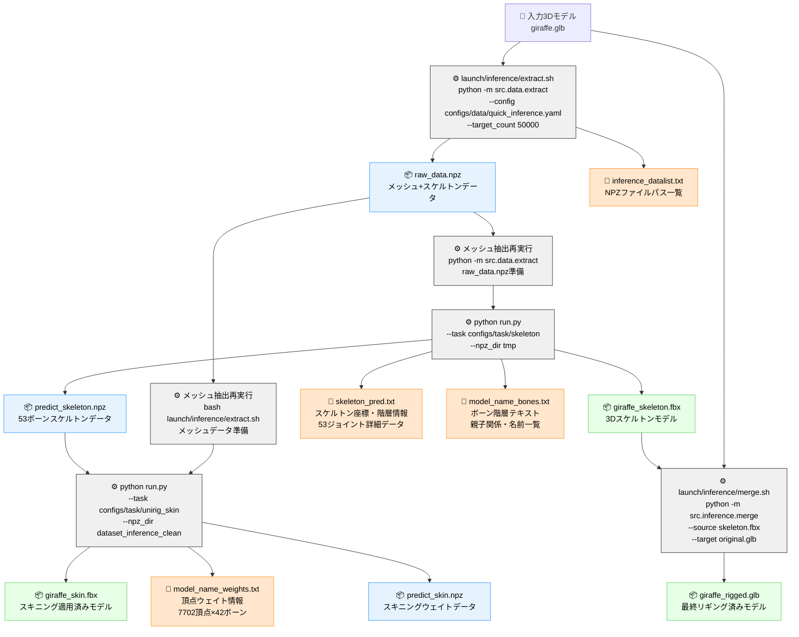
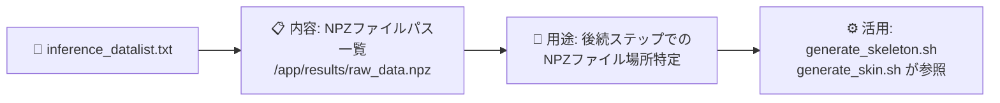
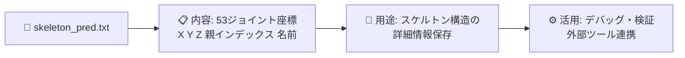
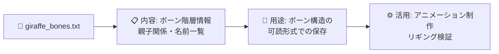
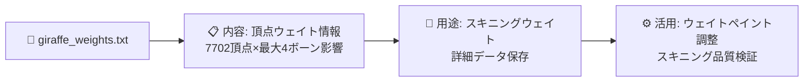
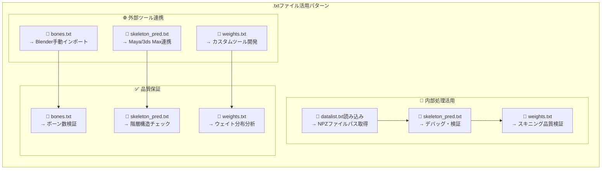

# 📋 原流処理スクリプト .txtファイル出力・後続活用 マーメイド図

## 🔍 原流処理における.txtファイルの生成・活用フロー



## 📄 .txtファイルの詳細内容・活用方法

### 🔸 Step 1 出力: `inference_datalist.txt`


**実際の内容例:**
```txt
/app/pipeline_work_fixed/01_extract/raw_data.npz
```

### 🔸 Step 2 出力: `skeleton_pred.txt`


**実際の内容例:**
```txt
# Skeleton Prediction Data
# Number of joints: 53
# Class: articulationxl
# Format: joint_index x y z parent_index name
0 0.003906 -0.027344 0.035156 -1 bone_0
1 0.003906 -0.066406 0.050781 0 bone_1
2 0.003906 -0.152344 0.074219 1 bone_2
...（53ボーン分）
```

### 🔸 Step 2 出力: `{model_name}_bones.txt`


**実際の内容例:**
```txt
# Bone Hierarchy for giraffe
# Total bones: 53
Bone  0: bone_0 (root)
Bone  1: bone_1 (parent: bone_0)
Bone  2: bone_2 (parent: bone_1)
...（53ボーン分の階層情報）
```

### 🔸 Step 3 出力: `{model_name}_weights.txt`


**実際の内容例:**
```txt
# Skinning Weight Information
# Vertex count: 7702
# Bone count: 42
# Max influences per vertex: 4
vertex_0000: bone_19=0.261 bone_21=0.252 bone_40=0.250 bone_33=0.237
vertex_0001: bone_36=0.255 bone_00=0.254 bone_17=0.253 bone_18=0.237
...（7702頂点分のウェイト情報）
```

## 🔄 .txtファイルの後続ステップでの活用パターン



## 📊 .txtファイル生成タイミング・容量・用途一覧

| ステップ | ファイル名 | 生成タイミング | 典型的サイズ | 主要用途 |
|---------|------------|---------------|-------------|----------|
| **Step 1** | `inference_datalist.txt` | extract.sh完了時 | ~100B | NPZファイルパス管理 |
| **Step 2** | `skeleton_pred.txt` | ARWriter.write_on_batch_end() | ~5KB | スケルトン座標詳細 |
| **Step 2** | `{model_name}_bones.txt` | スケルトン生成完了時 | ~2KB | ボーン階層情報 |
| **Step 3** | `{model_name}_weights.txt` | SkinWriter.write_on_batch_end() | ~500KB | 頂点ウェイト詳細 |

## 🎯 重要な技術的洞察

### 1. **ファイル間依存関係**
- `datalist.txt` → 全後続ステップでのNPZファイル発見
- `skeleton_pred.txt` → 外部ツールとのデータ交換
- `weights.txt` → スキニング品質の詳細検証

### 2. **命名規則の一貫性**
```bash
# 固定命名パターン
inference_datalist.txt          # 常に固定名
skeleton_pred.txt              # 常に固定名  
{model_name}_bones.txt         # モデル名プレフィックス
{model_name}_weights.txt       # モデル名プレフィックス
```

### 3. **後続ステップでの実際の参照方法**
```python
# datalist.txt の活用例
with open("inference_datalist.txt", "r") as f:
    npz_path = f.read().strip()
    
# skeleton_pred.txt の活用例
skeleton_data = []
with open("skeleton_pred.txt", "r") as f:
    for line in f:
        if line.startswith("#"): continue
        joint_data = line.strip().split()
        skeleton_data.append({
            "index": int(joint_data[0]),
            "position": [float(joint_data[1]), float(joint_data[2]), float(joint_data[3])],
            "parent": int(joint_data[4]) if joint_data[4] != "-1" else None,
            "name": joint_data[5]
        })

# weights.txt の活用例  
vertex_weights = {}
with open(f"{model_name}_weights.txt", "r") as f:
    for line in f:
        if line.startswith("vertex_"):
            vertex_id = line.split(":")[0]
            weights = line.split(":")[1].strip().split()
            vertex_weights[vertex_id] = {
                bone.split("=")[0]: float(bone.split("=")[1]) 
                for bone in weights
            }
```

---

**📝 注記**: このドキュメントは`README_ORIGINAL.md`および原流処理スクリプト（`launch/inference/*.sh`）の詳細分析に基づいています。実際の.txtファイルサンプルは`pipeline_work_fixed/`配下で確認済みです。
